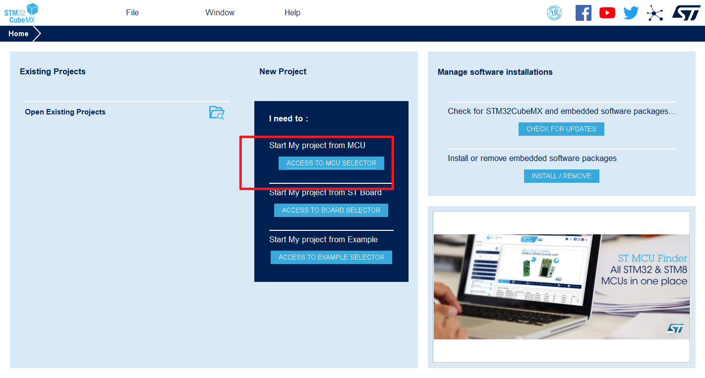
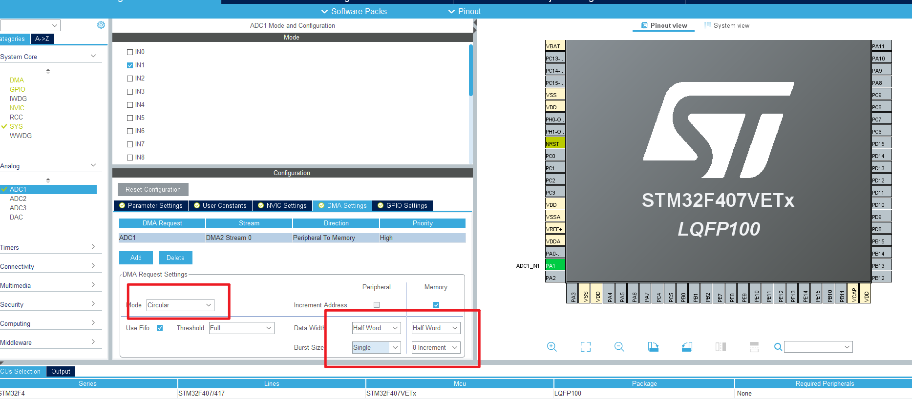
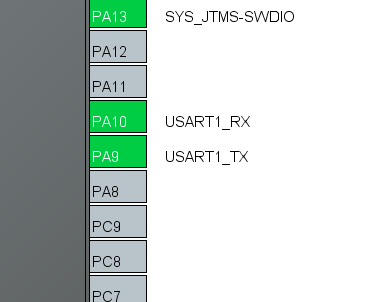
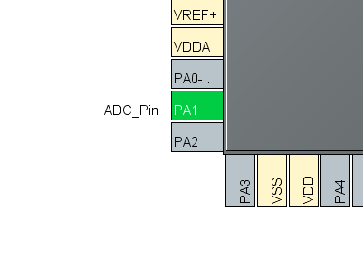
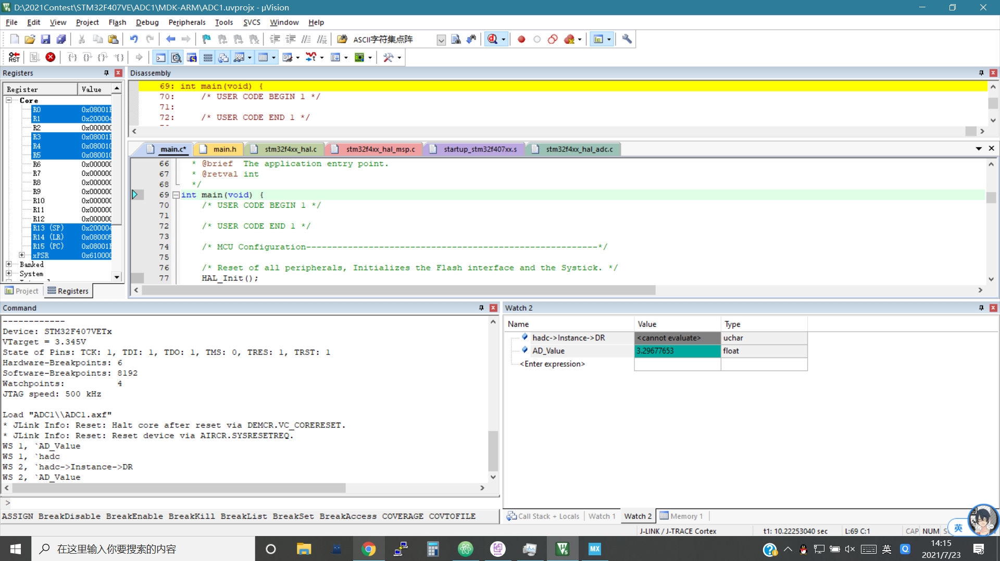
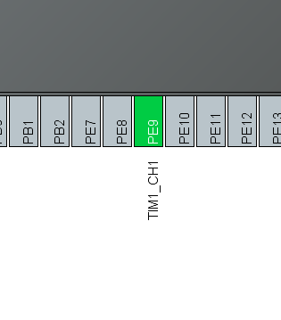
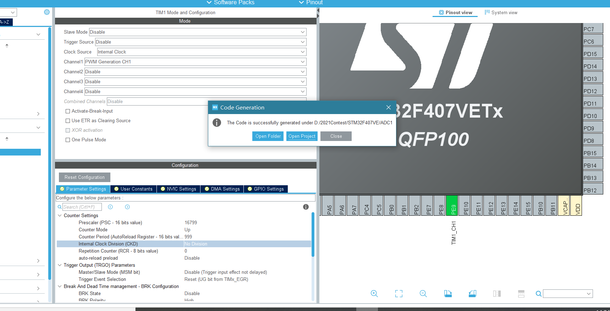
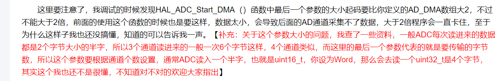

# day1

- 今日TO-DO

[] 在STM32F4上实现使用DMA+FIFO读取ADC的值(内置ADC)

[] 移植一些代码

## 在CubeMX中配置(?)

BURST的大小乘以数据大小不得超过设置的FIFO阈值大小，否则会出错

## step1: ADC+USART1

接下来来玩PWM. 让AD去测自己的PWM(看看能不能跟得上)

## 多通道ad+dma

[多通道adc+dma](https://blog.csdn.net/weixin_30810583/article/details/99339829)

