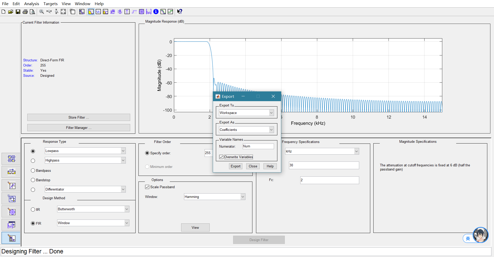
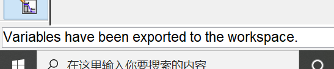
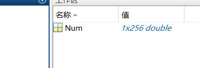
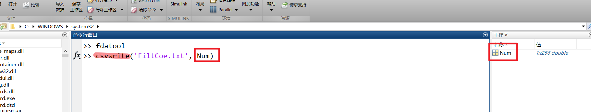
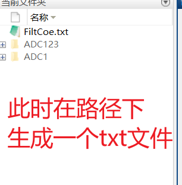
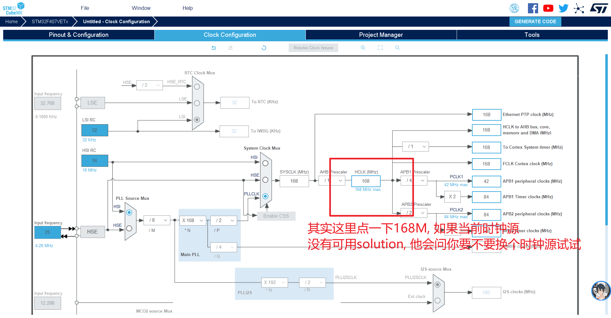
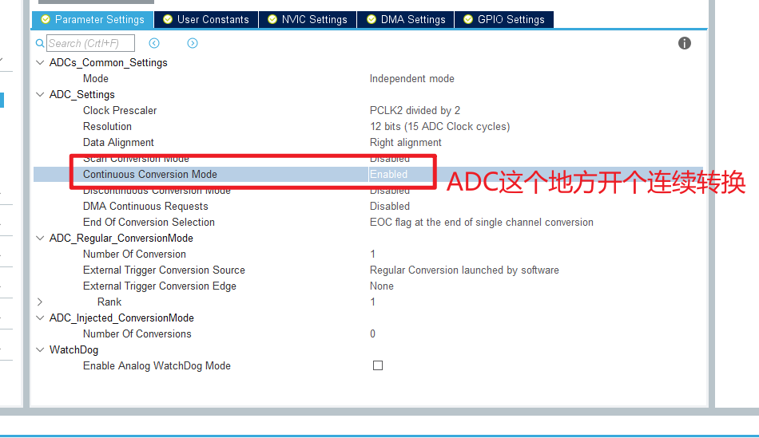
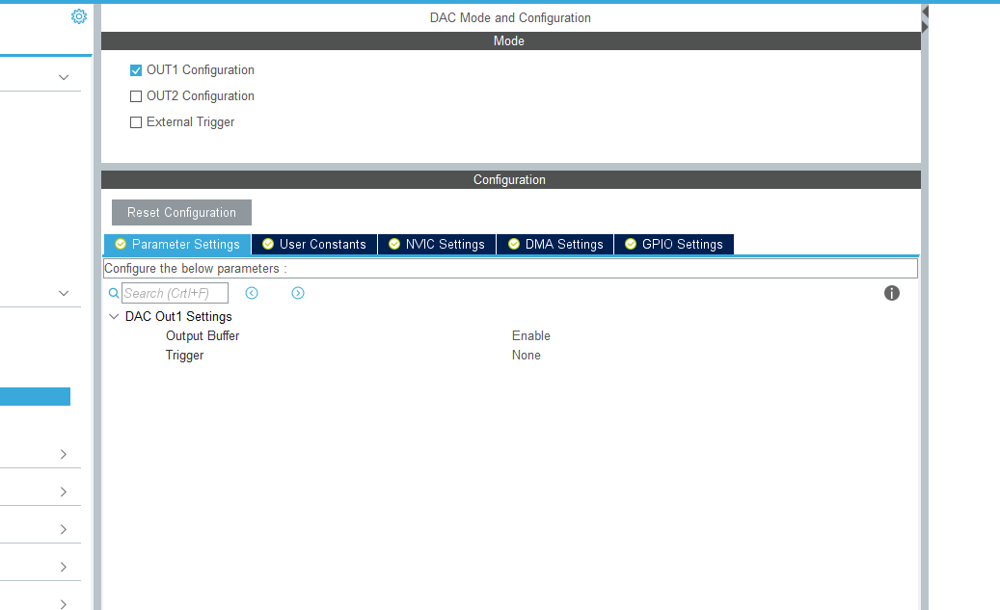

# working with MATLAB

256=255**+1**

- 之后在CubeMX中配置相关选项,包括:
    - ADC(input)
    - DAC(output)
    - 和一些时钟

接下来配置ADC和DAC, 全部都按正常配置就可以.

要是有特殊需求(高采样)也可以用DMA多通道连续采, 这里没必要

↑ DAC, 不用NVIC也不用DMA, 就输出
