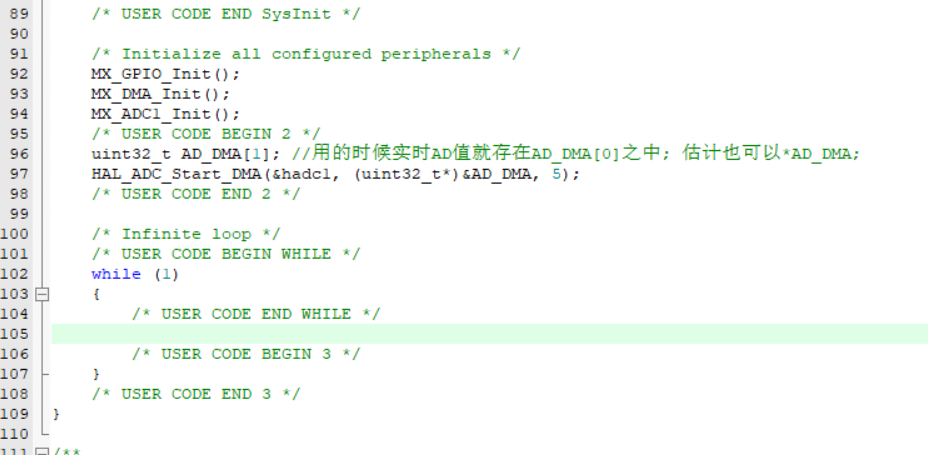

# fft在f4上的具体实现

## 使用STM32提供的DSP库进行FFT

>Reference:

> 1. [【STM32】使用STM32提供的DSP库进行FFT（附详细代码）](https://blog.csdn.net/qq_38410730/article/details/90116695?ops_request_misc=%257B%2522request%255Fid%2522%253A%2522162736986516780357264808%2522%252C%2522scm%2522%253A%252220140713.130102334..%2522%257D&request_id=162736986516780357264808&biz_id=0&spm=1018.2226.3001.4449)

> 2. [Hal库下使用32f4系列DSP运算功能](https://blog.csdn.net/weixin_41993663/article/details/107443888?depth_1-utm_source=distribute.pc_relevant_download.none-task-blog-2~default~BlogCommendFromBaidu~default-2.test_version_)

> 3. [STM32F4单片机ADC采样及ARM-DSP库的FFT](https://blog.csdn.net/QDchenxr/article/details/97624652?ops_request_misc=%257B%2522request%255Fid%2522%253A%2522162736986516780264097814%2522%252C%2522scm%2522%253A%252220140713.130102334.pc%255Fall.%2522%257D&request_id=162736986516780264097814&biz_id=0&spm=1018.2226.3001.4449))

> 4. [STM32 HAL库 CUBEMX FPU 和 DSP库 使用](https://blog.csdn.net/yuleitao/article/details/105621492)

↑ 2和4 好文推荐

> 模拟信号经过ADC采样后变成数字信号，数字信号可以进行FFT运算，在频域中更容易分析信号的特征。本文将介绍如何用STM32F4的进行ADC采样，并利用ARMDSP库里的FFT算法对ADC采样值进行快速傅里叶变换。


Tips:
1. ADC+DMA;
2. CLK频率问题;
3. 基4-浮点-fft算法.


**配置工程时,要加入DPS library.**

## 使用 CubeMX 配置初始工程文件


## 为工程文件添加 DSP 库

-> 只需要在点选的时候选择Copy all就完了(最简单)
-> 也可以手动添加(比较麻烦)


↑ 源码所在地


笑死, 强迫症()


```
,__TARGET_FPU_VFP,ARM_MATH_CM4,__CC_ARM
```

↑ 分享一些优质强迫症患者

## 在程序中实现fft

### AD+DMA(单通道)

首先是一段三通道的实例:


和一个手动卷积的代码:


```C
  /* USER CODE BEGIN 2 */
    HAL_DAC_Start(&hdac,DAC_CHANNEL_1);
//	volatile float AD_Value = 0;
	uint32_t AD_DMA[1];
	HAL_ADC_Start_DMA(&hadc1, (uint32_t*)&AD_DMA, 5); //启用DMA的ADC转换，AD_DMA 0~3 对应ADC 0~3，这里注意最后一个参数的大小

  /* USER CODE END 2 */

  /* Infinite loop */
    while (1)
  {
  /* USER CODE BEGIN WHILE */

	  float y = 0;
	  for(uint8_t i=0;i < FT_ORDER; i++){
		y = y + x[i] * h[FT_ORDER - 1 - i];
	  }
	  for(uint8_t i=0;i < FT_ORDER - 1; i++){
		x[i] = x[i+1];
	  }
	  x[FT_ORDER-1] = AD_DMA[0];
	  HAL_DAC_SetValue(&hdac,DAC_CHANNEL_1,DAC_ALIGN_12B_R, (int)y);

	//  delay_us(5);
    /* USER CODE END WHILE */
  }

  ```

  由以上代码可以得知, 此时AD+DMA可以直接写成:




### fft在代码中的实现


↑ 配一个uart传数据(异步即可)


在配置时一定要选对


就这个地方. 否则会报error L6789U:

```
error: L6789U: Library arm_cortexM4b_math.lib member arm_sin_f32.o : Endianness mismatch.
```


编译之后会有两个warning, 单双精度转换问题, 可以先不解决;
