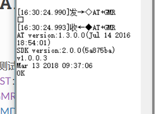
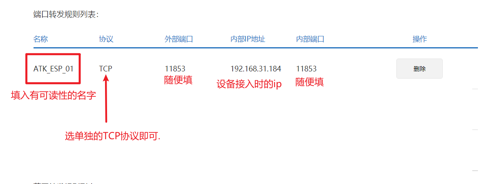

# day1

## 初始化ESP8266

[ESP-AT指南](https://docs.espressif.com/projects/esp-at/zh_CN/latest/Get_Started/index.html)


> ESP-AT 是基于 ESP-IDF 实现的软件工程。它使 ESP 模组作为从机，MCU 作为主机。MCU 发送 AT 命令给 ESP 模组，控制 ESP 模组执行不同的操作，并接收 ESP 模组返回的 AT 响应。ESP-AT 提供了大量功能不同的 AT 命令，如 Wi-Fi 命令、TCP/IP 命令、Bluetooth LE 命令、Bluetooth 命令、MQTT 命令、HTTP 命令、Ethernet 命令等。

## 使用串口调试的方式测试ESP8266

1. 安装CH340驱动
2. 连接UART串口后,发送指令
```
AT
```
, 此时回复`OK`.


接下来测试模块状态.

查看版本信息:




查看WiFi信号:


注意: 只能检索到2.4GHz的信号.(推测应该是不支持802.11ac协议)

连接并查看ip:


注意:
1. 尽量不要使用手机热点;有些手机配有省电模式(?)所以可能会突然断连;
2. 如果WiFi连接不成功, 检查是否名称与密码有输入错误

备注: 断开当前连接的指令:


接下来, 如果连接的是一个真正的路由器而不是`Hotspot`, 可以选择在路由器设置界面里面选择DCHP静态ip,
将ESP8266的ip设为静态ip, 方便以后的调试工作.


比如像这样↑

我连接了两个WiFi模块,所以配置了两个

接下来有两种通信的方式: 一种是从外网接入, 一种是从内网(局域网)接入.

### 外网接入

首先, 需要一个**已经接入互联网**的路由器, 进入它的设置界面即可获得运营商赏赐的公网ip(每次断电后再启动会不一样):


然后同样在路由器的设置界面, 找到端口转发:


填写一些该填写的信息:




接下来就可以在TCPClient端口进行连接通信了.

```
AT+CIPSEND\r\n  //开启透传模式

...(一些发出去的消息)

+++             //关闭连接

```


### 局域网内通信


