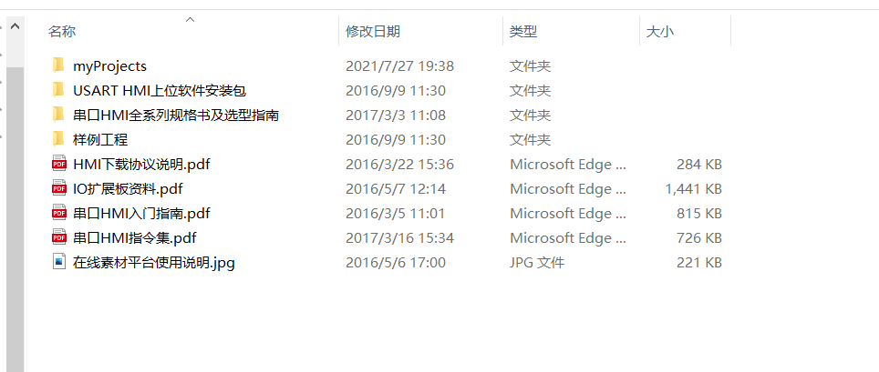

# uart/usart 串口屏

## 串口HMI入门指南

### 串口HMI

封装好HMI的底层功能以后,通过串口USART232与用户MCU进行交互,比如MCU
可以随时通过USART发指令通知设备切换某个界面或者改变某个组件的属性.
设备也可以随时通过USART通知用户MCU操作者目前操作了页面上的某个组件或者
设备当前进入了某个页面.

- 没有速度瓶颈
- 简单的显示方案
- MCU只需要发送指令, 不需要底层驱动
- 用户只需要对控件进行操作即可-> 关注控件属性, 支持简易运算
- 字符串指令

- 屏幕更新速度小于50ms
